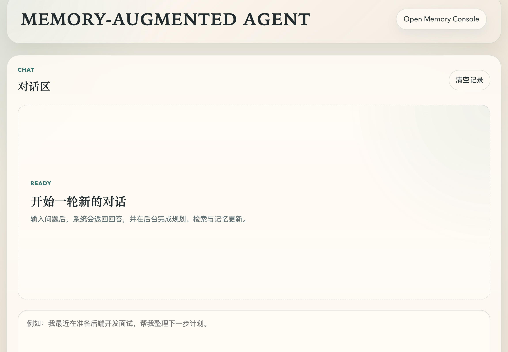
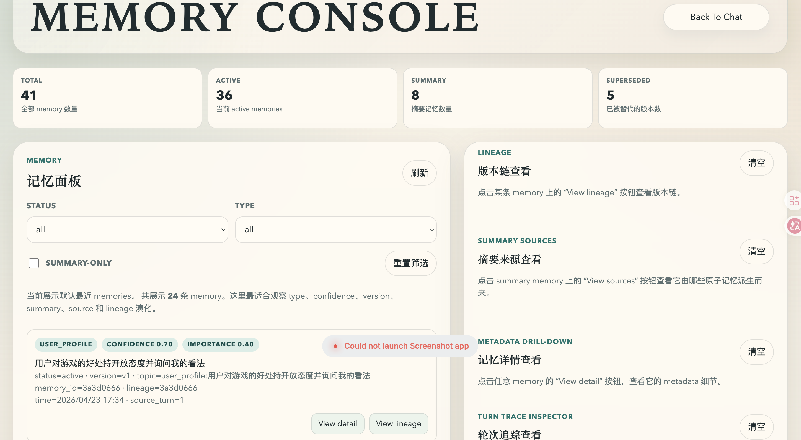
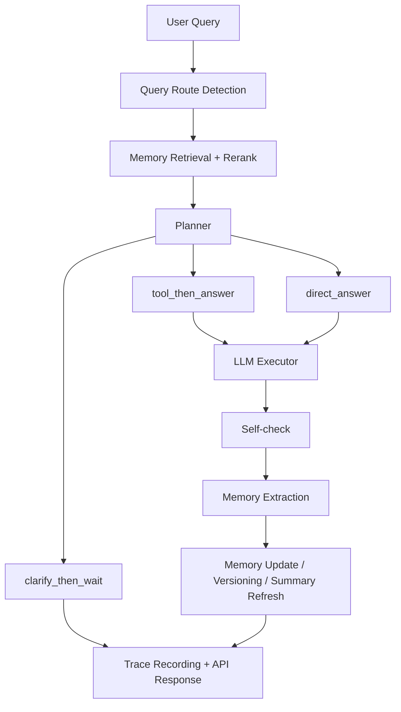

# Memory-Augmented Agent


> A self-built long-term memory agent that turns chat into a persistent, inspectable, versioned memory system.

## Preview

### Chat Demo



### Memory Console



## Why This Project

Most LLM demos stop at "ask a question -> get an answer".

This project goes one step deeper:

- it **stores durable user memories**
- it **retrieves them with route-aware scoring**
- it **updates conflicting memories with versioning**
- it **builds summary memories from atomic memories**
- it **records turn-level traces for observability**
- it **ships as a FastAPI service with UI, tests, and Docker deployment**

In short: `chat application -> memory system -> observable agent service`

## Core Highlights

### 01. Long-Term Memory, Not Static RAG

- Structured memory types: `fact`, `preference`, `event`, `user_profile`, `history`, `summary`
- Durable user modeling instead of one-shot retrieved snippets
- Memory extraction after each turn, followed by storage and governance

### 02. Retrieval Engineering

- Type-aware retrieval weighting
- Confidence-aware scoring
- Query-aware routing
- MMR reranking
- Route-specific memory ordering for prompting

### 03. Memory Governance

- Duplicate merge
- Conflict detection
- Versioning with `lineage_id`, `supersedes`, `superseded_by`
- Summary memory generation from active atomic memories
- Metadata drill-down and source trace

### 04. Agent Runtime Control

- Planner with `direct_answer / tool_then_answer / clarify_then_wait`
- Response self-check for language, tool alignment, and overclaim control
- Turn trace persistence for observability and debugging

### 05. Engineering Delivery

- FastAPI service layer
- Minimal web UI + memory console
- Pytest smoke suite
- Docker + Compose deployment

## System Flow



### Runtime Signals

- `query_route` explains how the user intent was classified before reasoning
- `turn_plan` explains why the agent answered directly, clarified, or tried a tool path
- `memory_lifecycle` shows whether the turn actually wrote, updated, versioned, or removed memory
- `turn traces` connect each answer back to retrieval, planning, and memory effects

## What You Can Open

| Surface | What it shows |
| --- | --- |
| `/app` | Minimal chat demo |
| `/app/memory.html` | Memory console with lineage, summary sources, metadata, and turn traces |
| `/docs` | FastAPI interactive API docs |
| `/traces` | Turn-level observability records |

Together, the chat page and memory console make the project feel less like a hidden backend demo and more like an inspectable agent system.

## Tech Keywords

These are the most representative keywords for this project:

`Memory-Augmented Agent` `Long-Term Memory` `Type-Aware Retrieval` `MMR`
`Query-Aware Routing` `Tool-Aware Planning` `Response Self-Check`
`Memory Versioning` `Memory Lineage` `Summary Memory`
`FastAPI` `SQLite` `Pytest` `Docker`

## Quick Start

### Local Run

```bash
uv sync
uv run uvicorn api.app:app --reload
```

Open:

- `http://127.0.0.1:8000/app`
- `http://127.0.0.1:8000/app/memory.html`
- `http://127.0.0.1:8000/docs`

For local development, `MEMORY_SQLITE_PATH` should point to a local relative path such as:

```env
MEMORY_SQLITE_PATH=data/memory_agent.db
```

Do not use `/app/data/...` when running `uvicorn` directly on your host machine. That path is only for the Docker container.

### Test

```bash
UV_CACHE_DIR=/tmp/uv-cache uv run --group dev pytest -q
```

### Docker

```bash
cp .env.example .env
docker compose up --build
```

## Configuration

At minimum, set these in `.env`:

- `OPENAI_API_KEY`
- `OPENAI_BASE_URL`
- `OPENAI_MODEL`

If you run the app locally with `uvicorn`, prefer:

- `MEMORY_STORE_BACKEND=sqlite`
- `MEMORY_SQLITE_PATH=data/memory_agent.db`

If you run with Docker, `compose.yaml` already overrides the SQLite path to:

- `MEMORY_SQLITE_PATH=/app/data/memory_agent.db`

If the LLM is unavailable, the service returns explicit configuration/runtime errors instead of silently hiding them.

## Project Map

```text
memory_agent/
├── agent/            # planner, executor, self-check
├── api/              # FastAPI app + static web UI
├── core/             # config, llm client, embedding
├── memory/           # schema, extractor, retriever, updater, store
├── observability/    # turn trace schema + trace store
├── service/          # application orchestration layer
├── tests/            # pytest smoke suite
└── tools/            # local inspection helpers
```

## Current Status

This project currently includes:

- end-to-end memory agent pipeline
- persistent SQLite-backed memory store
- trace visualization inside the memory console
- deterministic smoke tests for core behaviors
- Dockerized local deployment path
